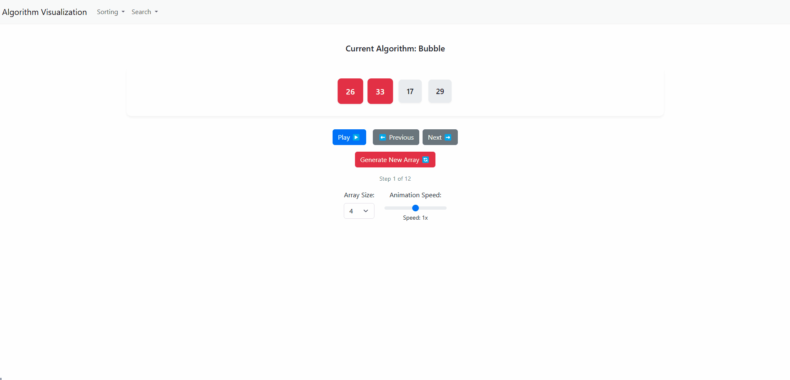

# Algorithm Visualizer

A web-based tool to visualize how sorting and searching algorithms work step-by-step. Built with vanilla JavaScript, HTML, and CSS.



---

## Features

- **Algorithms Implemented**:
  - Sorting: Bubble Sort, Selection Sort, Insertion Sort, Merge Sort, and Quick Sort.
  - Searching: Linear Search and Binary Search.
- **Interactive Controls**: Play/Pause, Speed Adjustment, Step Navigation.
- **Visual Highlights**: Compare, swap, and sorted elements are color-coded.
- **Dynamic Array Generation**: Generate random arrays of customizable size.

---

## Usage

1. **Generate Array**: Click "🔄 Generate New Array" to create a random array.
2. **Select Algorithm**: Choose an algorithm from the dropdown.
3. **Control Visualization**:
   - ▶️/⏸️ Play/Pause the animation.
   - ⬅️/➡️ Navigate steps manually.
   - Adjust speed using the slider (0.5x to 2x).

---

## Setup

No installation required! Open `index.html` in a browser. For local development:

```bash
git clone https://github.com/your-username/algorithm-visualizer.git
cd algorithm-visualizer
# Open index.html in your browser
```

---

## Code Structure
-   **main.js**: Core logic for UI interactions, step management, and playback.```

-   **sortAlgorithms.js**: Sorting algorithms' step generators (Bubble, Selection, Insertion, Merge, Quick).

-   **searchAlgorithms.js**: Search algorithms' step generators (Linear, Binary).

-   **display.js**: Functions to render steps and update the DOM.

---

Live Demo
Explore the live demo hosted on Vercel:
👉 https://algorithm-visualizer-git-main-jakmates-projects.vercel.app/


## Credits

Built by Jakub Orzolek

Hosted on Vercel.